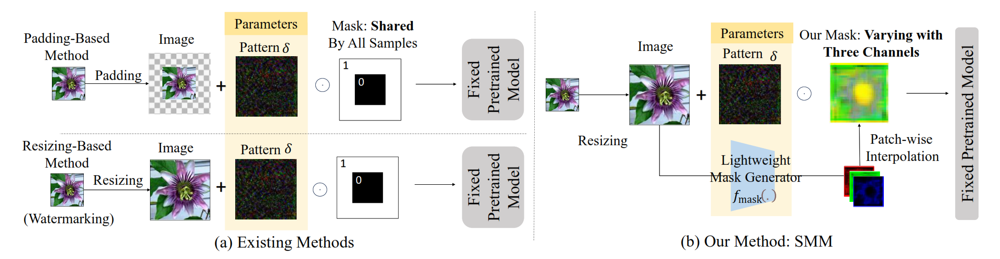

# Sample-Specific Multi-Channel Masks for Visual Reprogramming
This repository is the official PyTorch implementation of the **ICML2024** paper:
[Sample-Specific Multi-Channel Masks for Visual Reprogramming](),
authored by Chengyi Cai, Zesheng Ye, Lei Feng, Jianzhong Qi, and Feng Liu.

**Key Words:**
Visual Reprogramming, Pre-trained Models, Approximation Error, Machine Learning

**Abstract:**
*Visual reprogramming* (VR) aims to re-purpose a pre-trained model (e.g., a classifier on ImageNet) to target tasks (e.g., medical data prediction) by learning a *small-scale pattern* added into input images instead of tuning considerable parameters within the model. 
The location of the pattern within input samples is usually determined by a pre-defined mask *shared across all samples*. 
In this paper, we show that the shared mask potentially limits VR's generalization and increases its approximation error due to the lack of sample-level adaptation.
Motivated by this finding, we design a new framework for VR called *sample-specific multi-channel masks* (SMM). 
Specifically, SMM employs a lightweight ConvNet and patch-wise interpolation to generate sample-specific three-channel masks instead of a shared and pre-defined mask.
Since we generate different masks for individual samples, SMM is theoretically shown to reduce approximation error for the target tasks compared with existing state-of-the-art VR methods. We also empirically demonstrate its performance gain on both ResNet and ViT.
The success of SMM further highlights the broader applicability of VR in leveraging the latent knowledge of pre-trained models for various target tasks.

**Method:**

Comparison between existing methods (left) and our method (right). 
Previous padding-based reprogramming adds zeros around the target image, while resizing-based reprogramming adjusts image dimensions to fit the required input size. 
Both methods use a pre-determined *shared* mask to indicate the valid location of pattern $\delta$. Our method, on the other hand, takes a more dynamic and tailored approach. 
We resize each target image and apply a different three-channel mask accordingly, driven by a lightweight model $f_{\rm mask}$ and an interpolation up-scaling module, allowing for more variability in individual samples.

## Dataset
- For CIFAR10, CIFAR100, GTSRB, SVHN, use [TorchVision](https://pytorch.org/vision/0.15/datasets.html) to download them.
- For other datasets, follow the paper [ILM](https://github.com/OPTML-Group/ILM-VP) to prepare them.

Put all the download datasets in `/dataset/`, or modify the `data_path` in `cfg.py`.
## Environment

- Python (3.10.0)
- PyTorch (2.0.1) 
- TorchVision (0.15.2)
        
        pip install -r requirements.txt

## Training

- For CNN-based pretrained model

        python instancewise_vp.py --dataset cifar10 --network resnet18 --seed 0
        python instancewise_vp.py --dataset cifar10 --network resnet50 --seed 0

- For ViT-based pretrained model

        python instancewise_vp.py --dataset cifar10 --network ViT_B32 --seed 0

- Applying SMM to different output label mapping methods
        
        python instancewise_vp.py --dataset cifar10 --mapping_method rlm --seed 0
        python instancewise_vp.py --dataset cifar10 --mapping_method flm --seed 0

## Acknowledgements

This repo is built upon these previous works:

- [lukemelas/PyTorch-Pretrained-ViT](https://github.com/lukemelas/PyTorch-Pretrained-ViT)
- [OPTML-Group/ILM-VP](https://github.com/OPTML-Group/ILM-VP)

## Citation
    
    @inproceedings{cai2024sample,
        title={Sample-Specific Multi-Channel Masks for Visual Reprogramming},
        author={Chengyi Cai and Zesheng Ye and Lei Feng and Jianzhong Qi and Feng Liu},
        booktitle = {International Conference on Machine Learning (ICML)},
        year={2024}
    }
